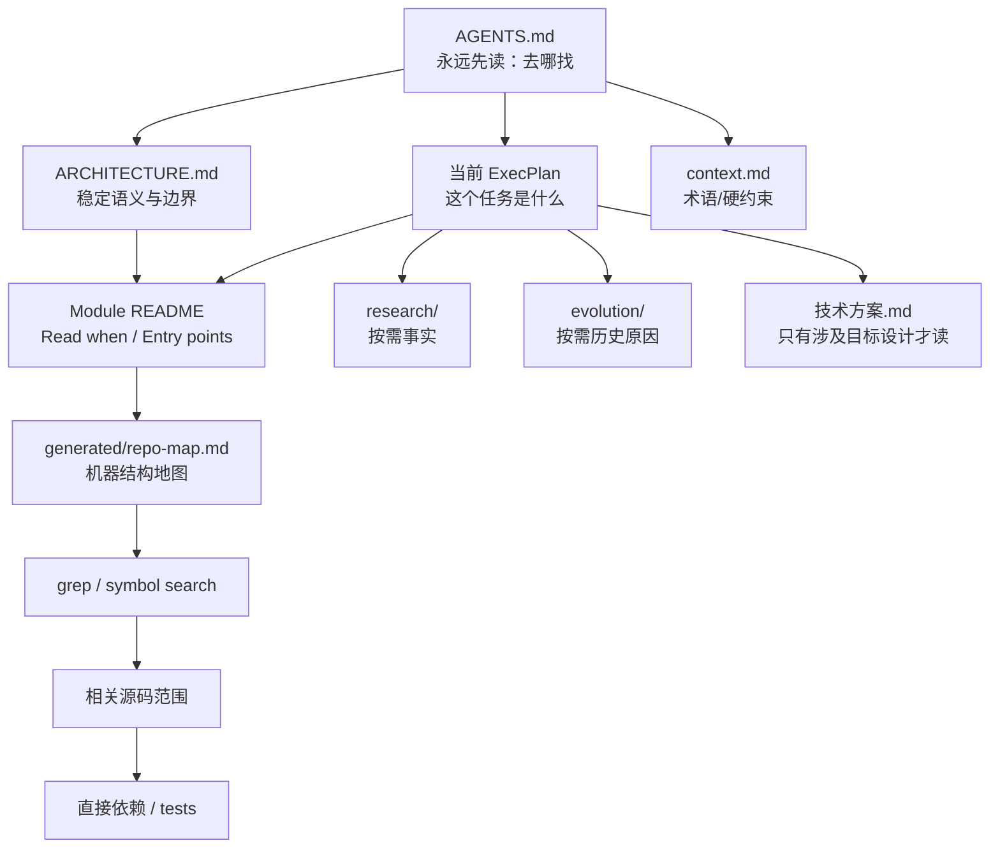
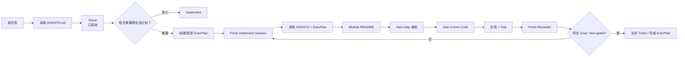
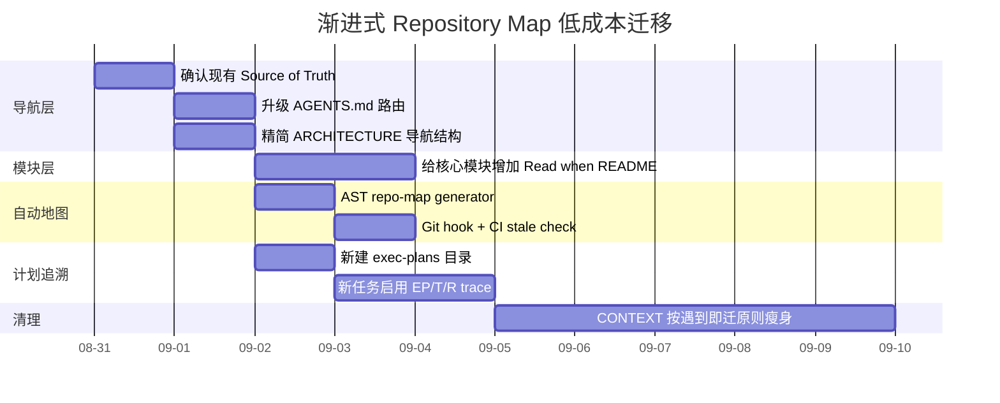

# 渐进式披露 Repository Map 深度调研与简化落地方案

## 执行摘要

我对你给出的方案、你上传的 `归档.zip` 与 `graph-plan.zip`，以及 mattpocock/skills、Wayfinder、grill-me / grill-with-docs、Aider、OpenAI Codex/AGENTS.md、Anthropic Context Engineering / Agent Skills、SWE-agent 的一手资料做了对照。

**结论先说：你不需要再引入一套 Wayfinder 级别的复杂“知识图谱”。你现有体系其实已经完成了约 70% 的工作。缺的主要不是更多文档，而是两件事：**

> **一个人工维护的“语义导航地图” + 一个机器维护的“代码结构地图”。**

推荐最终形态：

```text
                         AGENTS.md
                  极小、中文、永远先读
                         │
              ┌──────────┼───────────┐
              ↓          ↓           ↓
       ARCHITECTURE   当前 ExecPlan   context
        稳定语义地图    当前任务地图    硬约束
              │          │
              ↓          ↓
        Module README ← 任务相关模块
        Read when 路由
              │
              ↓
       generated/repo-map.md
       自动生成的符号/依赖地图
              │
              ↓
         grep / symbol search
              │
              ↓
          Just-in-time 源码
```

这实际上结合了三种目前最有价值的思路：

**Matt Pocock 的 lightweight repo-map 提案**告诉你“人工地图只记录目录树无法告诉你的东西”：依赖方向、canonical entry point、误导路径、generated 区域、结构边界；能从文件树便宜推断出的事实根本不该进地图。值得特别指出的是：截至 **2026 年 8 月 30 日**，这还是 mattpocock/skills 仓库的一个开放 Proposal #653，不是一个已经发布的 `map.md` 自动生成工具。citeturn15view0

**Aider**解决另一个维度：它自动提取仓库中的关键文件、class、function、signature，并根据代码依赖图和当前聊天相关性，在 token budget 内挑选相关部分；默认 `--map-tokens` 约 1k。它非常适合做**机器地图**，但不适合承担“LocalProbe 为什么不能调用 LLM”这种业务语义。citeturn17view0turn17view2

**OpenAI / Anthropic**则共同强调第三点：不要把所有知识预加载。OpenAI 的 agent-first repo 把约百行的 `AGENTS.md` 当 table of contents，把详细知识放在 repo 内、versioned 的 docs 中，并用 CI 检查；Anthropic 明确推荐让 Agent 通过搜索、文件结构和按需读取逐层发现 context。citeturn12search3turn16view4

你的上传样例尤其说明：**不应该推翻 graph-plan。** 你的 `graph-plan/evolve-plan/references/runtime-contract.md` 已经有一个非常好的权威关系：

```text
PLAN.md          → 下一步做什么
Evolution Graph  → 为什么变成现在这样
Code             → 现在实际上是什么
Git              → 具体发生过什么变化
```

而且已经规定“不为了了解整个仓库而无边界读取无关文件”。这本身就是正确的 progressive-disclosure 思路。

因此我建议**保留根 `PLAN.md` 和 Evolution Graph，不把它们强行迁移成另一套 Wayfinder**。新增的 `docs/exec-plans/` 只负责“一个具体功能跨 Agent / 跨 Context 如何实施”，不要再承担架构演化历史。

你当前样例里，`AGENTS.md` 只有约 15 行，这是好事；但 `docs/CONTEXT.md` 已约 573 行，`docs/技术方案_v2.md` 约 823 行，根 `PLAN.md` 约 181 行。**新 Agent 不应默认加载这三份长文档。** `AGENTS.md` 应告诉它什么时候需要其中哪一份。

最终建议采用下面的职责分工：

| Artifact | 唯一职责 |
|---|---|
| `AGENTS.md` | **去哪找** |
| `ARCHITECTURE.md` | **系统稳定边界是什么** |
| module `README.md` | **这个模块什么时候需要看、从哪里进去** |
| `docs/generated/repo-map.md` | **代码现在有哪些 symbol / imports / entry points** |
| 根 `PLAN.md` | **当前大版本下一步做什么** |
| `docs/exec-plans/EP-*` | **一个具体 change 怎么跨会话做完** |
| `docs/tickets/T-*` | **实际工作切片** |
| `research/R-*` | **我们查到了什么事实** |
| `evolution/EV-*` | **为什么架构长期变成这样** |
| `context.md` | **当前硬约束、术语、少量稳定事实** |
| `docs/技术方案` | **长篇目标设计细节** |
| Git | **真正发生过哪些变更** |

**不要自动生成 `ARCHITECTURE.md`；只自动生成 `repo-map.md`。** 机器可以可靠地发现 symbol/import/signature，但很难机械判断“这是 canonical editing surface”或“这个目录虽然叫 template 但其实是 generated artifact”。OpenAI 的实践也更接近“机器检查 + Agent 提 PR 修文档”，而不是允许 LLM 静默重写语义真相。citeturn12search3

## 调研结论与横向比较

这里有一个非常重要的术语澄清。

**Wayfinder 的 `map` 和 Repository Map 是两种完全不同的东西。**

Wayfinder 的 map 是：

```text
复杂问题
   ↓
Destination
   ↓
还没解决的决策 tickets
   ↓
逐个消除 fog
   ↓
Decisions so far
   ↓
最终得到可实施路线
```

它的官方定义明确说，map 是 **index, not store**；每个决定的完整内容只存在于一个 ticket 里，每个 session 先读 low-resolution map，再按需 zoom ticket。citeturn15view1

而你现在要解决的是：

```text
Agent 收到一个开发任务
       ↓
我应该读哪个模块？
       ↓
入口 symbol 在哪？
       ↓
哪些架构边界不能碰？
       ↓
只加载必要源码
```

这是 Repository Navigation Map。

二者可以借思想，但不应该混成一个文件。

| 项目 / 模式 | 主要目的 | 自动 / 人工 | 粒度 | 更新策略 | Read-when / 渐进读取 | 工具机制 | 优点 | 局限 | License / 原始资料 |
|---|---|---|---|---|---|---|---|---|---|
| **mattpocock lightweight repo map Proposal #653** | 保存“文件树无法可靠推出”的仓库导航语义 | 人工 / Agent 辅助 | dependency direction、canonical entry point、generated/deprecated/misleading path、结构边界 | 结构关系变化时更新，只保留 current truth | 主要靠链接 canonical source；强调只保存非显然信息 | Markdown；截至 2026-08-30 仍是 Proposal，不是已发布工具 | 极轻、人类可读、不重复代码事实，非常适合你的 `ARCHITECTURE + map` | 不自动发现 symbol；人工语义仍可能 drift | mattpocock/skills MIT。citeturn15view0turn13search0 [Proposal](https://github.com/mattpocock/skills/issues/653) |
| **Wayfinder** | 让一个超过单 session 的模糊问题逐步形成决策路线 | Agent + issue tracker | Map → child decision tickets → blocking/frontier | 每解决一个 ticket，更新 map 索引、fog 和新 ticket | **非常强**：每 session 只加载 low-res map，再按需读取相关 ticket | GitHub Issues 或 local Markdown tracker；blocking、claim、frontier | 跨 session 决策连续性很好；“index not store”非常值得借鉴 | 对普通 feature 太重；官方技能要求 ticket 约按单个 100K session 划分；当前还有 map body 持续增长等公开 issue | MIT。citeturn15view1turn12search15turn13search0 [Wayfinder Skill](https://github.com/mattpocock/skills/blob/main/skills/engineering/wayfinder/SKILL.md) |
| **grill-me / grill-with-docs** | 在写代码前把模糊想法问清楚、形成术语/硬决策 | `grill-me` 无持久化；`grill-with-docs` 会写 repo | 问题、术语、ADR | session 中逐步确认 | 更偏决策澄清，不是 repo navigation | Skills + CONTEXT.md + ADR | 很适合发现需求中的隐性决定 | **上游 `grill-me` 本身是 stateless、不会写文件**；`grill-with-docs` 官方文档承认大量普通决策只留在 conversation，并缺少贯通 decision→spec→ticket→test 的 ledger | MIT。citeturn16view0turn16view1turn16view2turn13search0 [grill-me](https://github.com/mattpocock/skills/blob/main/docs/productivity/grill-me.md) / [grill-with-docs](https://github.com/mattpocock/skills/blob/main/docs/engineering/grill-with-docs.md) |
| **Aider Repo Map** | 自动给模型看到全仓关键结构，同时避免塞整个 repo | 自动 | file、class、function、method、signature、部分关键代码 | 根据 repo / chat 重新计算；动态 token budget | 模型先看到 compact map，需要更多信息再要求加入具体文件 | symbol extraction + dependency graph ranking + token budget | **机器地图最佳参考**；几乎不要求人工维护 | 不理解你的领域语义和架构意图；不是人类长期设计文档 | Apache-2.0。citeturn17view0turn13search1 [Repo Map](https://aider.chat/docs/repomap.html) |
| **OpenAI AGENTS.md + Harness Engineering + ExecPlan** | 把 repo 本身变成 Agent 可导航、可继承的 system of record | 人工语义 + CI/Agent maintenance | root instructions → docs → plan → code | CI 检查 cross-link / stale docs；doc-gardening Agent 提修复 PR | `AGENTS.md` 是 table of contents，而不是 encyclopedia；ExecPlan 支持 fresh agent restart | AGENTS.md、versioned docs、ExecPlan、CI、linters | 和你的目标最匹配：小入口、repo-local knowledge、计划可交接 | 要设计清楚文档 authority，否则容易多份 source of truth | Codex CLI Apache-2.0；文章/格式为官方指导。citeturn12search3turn16view3turn14search0 [Harness Engineering](https://openai.com/index/harness-engineering/) / [ExecPlan](https://developers.openai.com/cookbook/articles/codex_exec_plans) |
| **Anthropic Context Engineering / Skills** | 控制 working context，让 Agent 自己按需发现信息 | 指导模式 / hybrid | metadata → instructions → resources；文件搜索 → 按需读取 | 依赖 filesystem current state，避免提前加载全部 index | **核心思想就是 progressive disclosure / JIT retrieval** | grep/glob、subagent、skills、filesystem | 很适合定义你的 runtime protocol；强调“simplest thing that works” | 不是一个现成 repo-map generator | 官方指导；不是单独 repo-map 开源包。citeturn16view4turn14search4 [Context Engineering](https://www.anthropic.com/engineering/effective-context-engineering-for-ai-agents) |
| **SWE-agent ACI** | 通过工具设计限制每一步给模型多少代码 | 自动 / runtime | file window、search result | 实时读取，不维护持久地图 | file viewer 每次约 100 行；目录搜索只返回紧凑匹配 | 专用 file viewer / search / linter | 强烈证明“少量、可导航 code view”优于 `cat` 大文件 | 不保存语义地图；SWE-agent 当前已 maintenance-only，官方建议迁移 mini-swe-agent | MIT。citeturn17view3turn13search2 [ACI](https://swe-agent.com/latest/background/aci/) |

还有一个非常值得直接借用的模式来自 **Agent Skills specification**。

它把渐进式披露规定为三层：

```text
Tier A   metadata
         ~100 tokens
         永远可见

Tier B   SKILL.md
         <5000 tokens 推荐
         只有技能被激活才读

Tier C   resources/
         scripts/references/assets
         真正需要时才读
```

官方最佳实践还强调，要明确告诉 Agent **“什么时候加载哪个文件”**，而不是泛泛写“更多内容见 references”。citeturn13search3turn13search11

这几乎可以一比一映射到你的仓库：

```text
Agent Skills                 你的 Repository

metadata              →      AGENTS.md
                           极小导航目录

SKILL.md              →      ARCHITECTURE.md
                              module README
                              当前 ExecPlan

resources             →      generated/repo-map
                              research
                              evolution
                              技术方案
                              source code
```

**这也是我建议你把 `Read when` 作为一等字段的根本原因。**

你的最佳方案不是复制某一个项目，而是：

```text
Matt #653
拿人工语义地图原则

+

Aider
拿自动 symbol map

+

OpenAI
拿 AGENTS + ExecPlan + docs as system of record

+

Anthropic / Agent Skills
拿 progressive disclosure runtime

+

你已有 graph-plan
继续负责 PLAN / Evolution
```

## 针对现有仓库的简化设计

基于你上传的样例，我建议**不大规模迁目录**，先演化成下面这样：

```text
repo/
│
├── AGENTS.md                         # 永远先读：导航
├── ARCHITECTURE.md                   # 稳定架构语义
├── PLAN.md                           # 保留！现有 graph-plan 契约
│
├── docs/
│   ├── context.md                    # 当前术语 + 硬约束
│   ├── 技术方案.md                   # 长篇目标设计
│   │
│   ├── exec-plans/
│   │   ├── active/
│   │   │   └── EP-024-ocr-line.md
│   │   └── completed/
│   │
│   ├── tickets/
│   │   └── T-137-ocr-line.md
│   │
│   └── generated/
│       └── repo-map.md               # AUTO GENERATED
│
├── evolution/
│   ├── EV-001-....md
│   └── EV-007-....md
│
├── research/
│   └── R-018-ocr-line.md
│
├── src/
│   ├── probes/
│   │   ├── README.md
│   │   └── local/
│   │       └── README.md
│   └── ...
│
└── tools/
    └── repo_map.py
```

这里特意**保留根 `PLAN.md`**。

原因不是理论，而是你现有 `graph-plan` 的 runtime contract 已明确规定只有：

```text
<root>/PLAN.md
<root>/evolution/*.md
```

是规范位置，而且 `PLAN.md` 是单文件、revision 单调增长。

现在直接把它搬进 `docs/exec-plans/`，会破坏你已经工作的 graph-plan skill。

所以使用两个不同层级的计划：

```text
PLAN.md
│
│  大版本 / program-level
│  “接下来整个版本往哪里走”
│
└────→ EP-024
       单个 change
       “这个功能跨几个 session 怎么完成”
```

OpenAI ExecPlan 的关键设计正是：一个 fresh agent 应该假设自己对 repository 完全不了解，只拿当前 working tree + 这一份 ExecPlan，也能恢复工作；Plan 本身必须维护 Progress、Decision 等信息。citeturn16view3

**`AGENTS.md` 模板**

你的 `AGENTS.md` 不应该描述具体实现，我建议控制在约 **80–150 行以内**；这不是硬限制，而是结合 OpenAI 约百行导航入口和你的规模给出的工程预算。OpenAI 自己的 harness 也是把短 `AGENTS.md` 当目录，而非百科。citeturn12search3

```md
# Agent 导航

本文件只负责路由，不是项目百科。

## Source of truth

- Code：现在实际上是什么。
- ARCHITECTURE.md：稳定模块边界与依赖关系。
- docs/技术方案.md：已接受目标设计。
- PLAN.md：当前大版本下一步做什么。
- docs/exec-plans/：单个具体变更如何实施。
- evolution/：为什么架构变成现在这样。
- research/：调研事实，不自动等于决策。
- docs/tickets/：执行切片。
- docs/generated/repo-map.md：自动生成的代码结构索引。

## 任务路由

| 当前任务 | 先读 | 然后 |
|---|---|---|
| 跨模块架构修改 | ARCHITECTURE.md | 相关 module README |
| LocalProbe | src/probes/local/README.md | 对应源码 |
| 当前大版本 | PLAN.md | PLAN.context 指向的 EV |
| 一个具体 feature | 对应 ExecPlan | module README |
| 需要理解历史原因 | 相关 evolution/EV-* | 必要时 Git |
| 不知道代码入口 | generated/repo-map.md 中搜索 | 再读命中的源码 |
| 外部技术事实 | 对应 research/R-* | 必要时重新验证 |

## 阅读规则

1. 不为“了解整个仓库”而全仓扫描。
2. 先读模块 README，再按 Read when 打开源码。
3. generated/repo-map.md 先搜索，不默认全文加载。
4. Source file > generated map。
5. Code 与说明文档冲突时，以 Code 描述 Current，并修正文档。
6. 不做当前需求之外的顺手重构。
```

这对应 Matt #653 的一个核心原则：Repository Map 不应该复制能从目录和局部文件轻易得出的事实，而应该保存真正非显然的结构关系，并指向 canonical source。citeturn15view0

**`ARCHITECTURE.md` 模板**

这里不要放完整 class/function 清单。

只放稳定关系：

```md
# 架构地图

## Core flow

Document
  ↓
Bootstrap
  ↓
DocumentContext
  ↓
Template
  ↓
Plan
  ↓
Probe Dispatcher
  ├─ LocalProbe
  ├─ ExtractProbe
  └─ AgentProbe

## 模块路由

| 能力 | 入口 | Read when |
|---|---|---|
| Probe 总体 | src/probes/README.md | 修改 Probe 共享协议 |
| LocalProbe | src/probes/local/README.md | 修改确定性规则 |
| OCR | src/ocr/README.md | 修改 OCR provider / extraction |
| Template | src/template/README.md | 修改 plan 生成 |

## Dependency direction

允许：

Template → Plan → Probe → DocumentContext

禁止：

LocalProbe → LLM
DocumentContext → Probe

## 长设计文档

完整目标设计：
`docs/技术方案.md`

只有任务涉及目标架构时才读取，不作为普通 session boot context。
```

**module `README.md` 模板**

这是你整个体系里我认为**最值得新增**的东西：

```md
# LocalProbe

## Responsibility

确定性检查。
禁止 LLM 推理。

## Entry points

- `probe.py::LocalProbe.execute`
- `rules.py`：确定性规则
- `registry.py`：规则注册

## Read when

新增确定性规则：
1. 先读 `rules.py`
2. 再读 `probe.py`
3. 只有注册方式变化时读 `registry.py`

修改 OCR provider：
不要读本模块。
去 `src/ocr/README.md`。

## Dependencies

Uses:
- Plan
- DocumentContext

Must not depend on:
- AgentProbe
- LLM client

## Change guide

新增简单 rule 时：
优先复用现有实现。
不要为单个 rule 新建 abstraction layer。
```

这里的价值不是 README 本身，而是把：

```text
目录 → 文件
```

变成：

```text
任务 → 下一份应该看的信息
```

这与 Agent Skills 官方“明确告诉 Agent 什么时候加载资源”的建议完全一致。citeturn13search11

**`docs/exec-plans/active/EP-024-xxx.md`**

```md
---
id: EP-024
status: active
ticket: T-137
research:
  - R-018
evolution:
  - EV-007
modules:
  - src/probes/local
---

# OCR Line 判断

## Goal

给 LocalProbe 增加最小 OCR line 判断能力。

## Non-goals

- 不重构 Probe interface
- 不引入新的 OCR abstraction
- 不修改 AgentProbe
- 不调整整体 pipeline

## Current facts

- LocalProbe 当前入口：
  `src/probes/local/probe.py::LocalProbe.execute`
- 已有 line 数据：
  `...`

每一条重要事实必须能回指代码、测试或运行结果。

## Relevant files

- src/probes/local/rules.py
- src/probes/local/probe.py
- tests/probes/test_local_probe.py

## Existing reusable code

...

## Decision log

2026-08-30：
优先复用现有 line 字段，不新增数据层。

## Plan

1. 验证输入
2. 最小实现
3. 补测试
4. 验证

## Acceptance

- 新用例通过
- 现有测试通过
- 不增加 LLM 调用
- 无范围外重构

## Progress

- [x] Scout
- [ ] Implement
- [ ] Review

## Trace

Ticket: docs/tickets/T-137-ocr-line.md
Research: research/R-018-ocr-line.md
Evolution: evolution/EV-007-....md
```

这里不用把 OpenAI 原版 `PLANS.md` 全部照搬。它的完整模板是为 multi-hour autonomous work 设计的；你的版本只需要保留它最关键的思想：**self-contained、living、Goal、Progress、Decision、Acceptance、可从 fresh context 恢复。**citeturn16view3

**`generated/repo-map.md`**

这个文件必须明确标记：

```md
<!-- GENERATED by tools/repo_map.py; DO NOT EDIT -->

# 自动生成仓库结构图

源代码哈希：sha256:3428...

用途：
只负责发现代码位置、符号和结构依赖。
业务语义请读 ARCHITECTURE.md / module README。

新 Agent：
先搜索相关 symbol。
不要默认全文加载。

## src/probes/local/probe.py

符号：
- class LocalProbe
- LocalProbe.execute(self, plan, context)

Imports:
- .rules
- core.models

## src/probes/local/rules.py

符号：
- check_text_line(...)
- check_page_count(...)

Imports:
- core.context
```

这里我反而**不建议加入人工生成的“文件用途摘要”**，除非它来自 module README 的结构化字段。

否则会出现：

```text
代码变了
↓
symbol map 是新的
↓
LLM 自动写的“用途解释”还是旧的 / 猜的
↓
generated map 反而成为错误语义
```

Aider 的 Repo Map 主要也是围绕 symbol、definition、signature 和依赖相关性来帮助模型决定下一步应该打开哪个文件，而不是尝试替代架构文档。citeturn17view0

Repository 层级最终是：



## 自动更新与运行协议

自动化这里建议**克制**。

不要一开始复制 Aider 的 graph-ranking、PageRank 式相关性系统。

对于你当前规模，最简单可靠的方案是：

> **Python 项目先用标准库 `ast` 全量重建一个 deterministic repo-map。仓库未来真正多语言后，再换 Tree-sitter。**

Aider 的图排序很适合在大 repository 中控制动态 token budget，但你现在真正需要的是“结构地图不 stale”，而不是建立另一个 coding agent runtime。citeturn17view0

推荐生成流程：

```text
git ls-files
     ↓
只选 src/**/*.py
     ↓
AST parse
     ↓
提取
- class
- function
- method
- signature
- imports
     ↓
按 path 排序
     ↓
计算 source hash
     ↓
repo-map.md
```

伪代码：

```python
files = git_ls_files("*.py")

for file in files:
    tree = ast.parse(file)

    collect:
        classes
        top-level functions
        public methods
        imports

    emit_markdown(file, symbols, imports)

write("docs/generated/repo-map.md")
```

不要写 `generated_at: 2026-...`。

否则每次执行都会产生无意义 diff。

建议写 deterministic source hash：

```text
source_hash =
SHA256(
  sorted_path_1 + contents
  + sorted_path_2 + contents
  ...
)
```

于是：

```text
代码没变
→ map bit-for-bit 不变

代码变了
→ source hash / symbols 改变
→ Git 能看到真正结构 diff
```

**本地 hook**

追求真正“自动更新”时：

```sh
#!/bin/sh
set -eu

python tools/repo_map.py
git add docs/generated/repo-map.md
```

我更建议团队 CI 仍然独立验证，而不是信任 hook，因为 Git hook 可以被跳过。

**CI**

```yaml
name: repo-map

on:
  pull_request:
  push:
    branches: [main]

jobs:
  check:
    runs-on: ubuntu-latest

    steps:
      - uses: actions/checkout@v4

      - uses: actions/setup-python@v5
        with:
          python-version: "3.12"

      - name: Regenerate map
        run: python tools/repo_map.py

      - name: Map must be up to date
        run: git diff --exit-code -- docs/generated/repo-map.md
```

这里最重要的是：

```text
机器事实
        ↓
自动更新 / 强校验

语义事实
        ↓
检测影响 / 人工审核
```

而不是：

```text
代码一变
↓
LLM 自动重写 ARCHITECTURE.md
↓
直接 commit
```

OpenAI 的 Harness Engineering 做法也是用 linters/CI 检查文档结构和 freshness，再通过 doc-gardening agent 发现 stale docs 并提出修复，而不是把所有 repo knowledge 当作无审查的自动生成内容。citeturn12search3

你还可以加一个很轻的 **semantic impact check**：

```sh
changed="$(git diff --name-only origin/main...HEAD)"

echo "$changed" | grep '^src/probes/' &&
    echo "CHECK: src/probes/README.md / ARCHITECTURE.md 是否受影响"

echo "$changed" | grep '^src/core/' &&
    echo "CHECK: ARCHITECTURE.md 是否受影响"
```

以后再升级为：

```text
public class/function signature changed
        ↓
CI warning

module moved/deleted
        ↓
module README / ARCHITECTURE link check

new top-level module
        ↓
要求有 README 或显式 ignore
```

**diff-based update 不建议用来优化 repo-map generation。**

你的规模直接全量 AST 重建通常更简单，也不会引入 cache invalidation。

Diff 更适合解决：

> “这次代码修改是否可能让人工语义地图过期？”

即：

```text
git diff
   ↓
changed modules
   ↓
map impact check
   ↓
需要人工确认的 docs
```

真正的 runtime protocol，我建议固定成：



**Scout 精确 Prompt：**

```text
角色：Scout。

只调查，不修改代码，不做重构。

任务：
<当前任务>

读取顺序：

1. AGENTS.md。
2. 根据其中的 Read when，只加载当前任务相关的
   ARCHITECTURE / module README / context / ExecPlan。
3. 如果不知道代码入口，在 docs/generated/repo-map.md
   中搜索相关 symbol；不要整文件读取。
4. 再读取入口源码、直接依赖和相关测试。

禁止：
- 为了“了解整个项目”扫描整个 repository。
- 先设计新 abstraction 再找需求。
- 修改任何源文件。
- 提出当前需求以外的重构。

输出：

Goal
Non-goals
Current behavior
Relevant files and symbols
Existing reusable code
Architectural constraints
Minimal change strategy
Acceptance criteria
Unknowns

如果任务需要跨 session，
创建/更新对应 ExecPlan。
```

**Implement 精确 Prompt：**

```text
你是新的实现 Agent。

先读：
1. AGENTS.md
2. 当前 ExecPlan
3. ExecPlan 指定的 module README

然后：

- 验证 ExecPlan 中的 Current facts。
- 只有入口不明确时搜索 generated/repo-map.md。
- 只读取实现所需源码和直接依赖。
- 以最小 diff 完成 Goal。
- 不实现 Non-goals。
- 不做顺手重构。
- 不增加当前需求不需要的 abstraction。
- 优先复用 Existing reusable code。

Code 与 ExecPlan 冲突时：
以 Code 为 Current truth，
更新 ExecPlan 的 Current，再继续。

完成后：
运行 Acceptance 中的验证，
更新 Progress，
列出真实修改文件和测试结果。
```

**Fresh Reviewer 精确 Prompt：**

```text
你是独立 Reviewer。

不要读取 Implementer 的聊天历史。

只读取：

1. AGENTS.md
2. 当前 ExecPlan
3. git diff
4. 测试结果
5. 只有验证某个争议点时才打开相关源码

检查：

- Goal 是否真的满足？
- Non-goals 是否被违反？
- 是否存在范围外修改？
- 是否引入不必要 abstraction？
- 是否重复实现已有能力？
- 是否违反 ARCHITECTURE/module README 中边界？
- Acceptance criteria 是否有真实证据？
- Plan/Ticket/Research trace 是否完整？

不要主动扩展功能。
发现问题时指出最小修复。
```

Anthropic 现在明确推荐探索先于实现，并建议把 investigation 放进独立 subagent context，避免大量文件读取污染主实现 context；也建议用独立 Agent 做 adversarial verification。citeturn14search1turn14search4

**建议 token / 阅读预算**

下面是我的工程建议，不是厂商硬限制：

| Context | 建议预算 |
|---|---:|
| `AGENTS.md` | ≤ 1,500 tokens |
| 初始启动文档总量 | ≤ 4,000 tokens |
| 一个 module README | ≤ 800 tokens |
| 当前 ExecPlan | ≤ 2,500–4,000 tokens |
| generated map 单次读取 | 搜索结果优先；≤ 1,500 tokens |
| 单次源码 window | 约 100–250 行 |
| Scout 未说明原因时 | ≤ 8 个源码文件 |
| 跨模块 | 默认 ≤ 2 个相邻 module；超出要说明原因 |

这不是因为模型“只能看这些”，而是防止 Agent 把 context window 当仓库缓存。Aider 默认把 repo-map budget 控在约 1k tokens；SWE-agent 的实验也发现 file viewer 每次约 100 行效果较好，而且全目录搜索如果返回过多上下文反而会使模型更困惑。citeturn17view2turn17view3

Anthropic 的总体原则也是：允许 Agent 用 `grep/head/tail`、文件结构和搜索逐步取数据，而不是把完整对象预加载进 context。citeturn16view4

## 变更追溯与回填

你现有系统已经有非常好的基础：

```text
PLAN
Evolution
Ticket
Research
Git
```

现在缺的是**稳定 ID 和 cross-link**。

不要再建立一个复杂 graph database。

直接定义五类 ID：

```text
EP-024    ExecPlan
T-137     Ticket
R-018     Research
EV-007    Evolution
Git SHA   Code change
```

链路：

```text
                 ┌────────── R-018
                 │          事实/证据
                 │
T-137 ───────→ EP-024
工作切片         │
                 │
                 ├──────────→ Commit A
                 ├──────────→ Commit B
                 │
                 └──────────→ EV-008
                               只有产生持久设计变化时
```

最重要的原则：

> **Research ≠ Decision ≠ Plan ≠ Commit。**

Wayfinder 自己当前也有一个公开 issue，专门讨论“closed research ticket 不应自动成为 Decisions-so-far 中的 decision”，说明事实与决策混在一起确实会破坏地图语义。citeturn12search19

你上传的 graph-plan 已经正确把 Evolution 定义成持久设计变化，因此不要改变它。

**ExecPlan frontmatter：**

```yaml
---
id: EP-024
status: active
ticket: T-137
research:
  - R-018
evolution:
  - EV-007
modules:
  - probes/local
---
```

**Ticket：**

```yaml
---
id: T-137
status: open
exec_plan: EP-024
---
```

**Research：**

```yaml
---
id: R-018
consumed_by:
  - EP-024
---
```

我不建议为了这个新体系立刻改你的 Evolution Node schema。

你现在 graph-plan 的 EV schema 已经有：

```yaml
id:
date:
area:
evolves_from:
depends_on:
status:
```

保持它不变。

需要关联时从 ExecPlan 链过去即可。

**Commit 使用 trailers**

```text
feat(probe): add OCR line check

Plan: EP-024
Ticket: T-137
Research: R-018
```

Git 原生的 `git interpret-trailers` 就是为了在 commit message 尾部解析这类 `Key: Value` metadata，并且 Git 官方有中文文档。citeturn12search0turn12search14

例如：

```sh
git log \
  --format='%h %s %(trailers:key=Plan,valueonly)'
```

于是你可以回答：

```text
EP-024 被哪些 commits 实现？
T-137 最后落在哪？
R-018 被哪个功能使用？
```

甚至以后自动生成：

```text
docs/generated/trace-index.md
```

但这应该是**可选的 generated view**，而不是新的 source of truth。

**完成流程**

```text
Ticket T-137
     ↓
ExecPlan EP-024
     ↓
Commits
     ↓
Acceptance Passed
     ↓
EP 移动：
active/
→
completed/

Ticket：
open
→
closed

如果形成长期设计变化：
新增 EV

否则：
不要新增 EV
```

这正好避免你当前体系最容易发生的一个问题：

```text
每完成一个 feature
↓
都写一个 Evolution
↓
Evolution 最后退化成 changelog
```

而你的 graph-plan runtime contract 本身已经规定：

> Evolution 的长期单位是“设计变化”，不是执行步骤。

继续保持这个原则。

**历史回填不要全量做。**

推荐：

```text
过去所有历史
      ↓
不要整理

最近 2~4 个 active / relevant workstreams
      ↓
补 ID 和链接

未来新工作
      ↓
强制 trace
```

老资料处理规则：

```text
能从 Git / docs 明确证明
→ 建立 link

只有时间上“看起来可能相关”
→ 标记 inferred

无法证明
→ 不链接

绝不为了图完整而猜
```

这也符合 Matt repo-map Proposal 的方向：地图只保存 current truth，不承担 status、history、implementation plan 或 changelog。citeturn15view0

对于你提到的 **grill-me generated key decisions**，这里需要特别校正：

上游 mattpocock 的 `/grill-me` 本身**不写任何文件**；它是 stateless。真正 stateful 的 `/grill-with-docs` 才会把术语写进 `CONTEXT.md`，把满足严格条件的 hard decision 写 ADR。官方文档还明确承认，大量普通决定会留在 conversation 中，并且目前不存在贯通每个回答到 spec、ticket、test 的 ledger。citeturn16view0turn16view1turn16view2

所以你的自定义 grill 流程最好这样收口：

```text
Grill 结果
   │
   ├─ 术语 / invariant
   │      ↓
   │   context.md
   │
   ├─ 当前 feature 的普通决定
   │      ↓
   │   ExecPlan Decision Log
   │
   ├─ 外部事实
   │      ↓
   │   research/R-*
   │
   └─ 长期、难逆、真正改变设计的决定
          ↓
       Evolution EV-*
```

**不要再单独维护一个“grill decisions 总账”。**

否则：

```text
context
+
grill decisions
+
ExecPlan decisions
+
Evolution
+
技术方案
```

五份文件都会开始争夺“谁才是决定的真相”。

## 迁移计划与示例包

对你目前的 repo，我建议**只做增量迁移**。

第一阶段甚至不用移动已有文件。

**目标结构：**

```text
/
├── AGENTS.md
├── ARCHITECTURE.md
├── PLAN.md                       ← 保持 graph-plan 契约
│
├── docs/
│   ├── context.md
│   ├── 技术方案.md
│   ├── exec-plans/
│   │   ├── active/
│   │   └── completed/
│   ├── tickets/
│   └── generated/
│       └── repo-map.md
│
├── evolution/
├── research/
│
├── src/
│   ├── module-a/
│   │   └── README.md
│   └── module-b/
│       └── README.md
│
└── tools/
    └── repo_map.py
```

**低成本迁移顺序**

首先，不改 `PLAN.md` / Evolution Graph。

你已经有一套可工作的 graph-plan runtime，不值得为了形式统一重新设计。

接着，把当前 `AGENTS.md` 从：

```text
“这里有几个 agent docs”
```

升级成：

```text
“面对什么任务 → 先读什么”
```

然后，只给**真正有边界意义的模块**加 README。

不要每个目录都加。

例如：

```text
src/probes/README.md
src/probes/local/README.md
src/template/README.md
src/bootstrap/README.md
```

如果某个目录名称和代码已经足够直观：

```text
utils/
constants/
tests/
```

不需要为了“地图完整”再创建 README。Matt #653 的 Proposal 同样明确反对 directory-tree mirror 和 generated inventory 式的人工地图。citeturn15view0

再增加：

```text
tools/repo_map.py
docs/generated/repo-map.md
CI
```

然后把 `CONTEXT.md` 的职责逐步变窄。

你的样例目前 `CONTEXT.md` 很长，其中已经包含不少设计原则和关键决定；建议不是一次性重写，而是：

```text
新内容开始执行新规则

旧内容：
只有遇到时再搬
```

最终：

```text
context.md
只留：
- glossary
- invariant
- current hard constraints

长期设计为什么：
→ evolution

详细设计：
→ 技术方案

某个 feature 的决定：
→ ExecPlan
```

最后才开始对**新的跨 session feature**使用 ExecPlan。

不要给所有 bug 建 ExecPlan。

建议门槛：

```text
一个 session 可以稳妥完成
→ Ticket / graph-plan 小计划即可

需要大量 Scout
或跨 2+ modules
或下一 session 必须继承当前推理结果
→ ExecPlan

问题本身还不知道到底要做什么，
需要大量人类/研究决策逐步消雾
→ Wayfinder-like flow
```

Wayfinder 官方自己也明确说：如果 breadth-first charting 后发现没有 fog，而且整个旅程一个 session 就能完成，那就不需要 Wayfinder map。`grill-with-docs` 文档也指出，对 well-scoped feature 使用 Wayfinder 是常见的过度使用。citeturn15view1turn16view1

建议迁移时间线：



我已经按这套方案生成了一个可以直接解压查看的完整样例，包括：

```text
AGENTS.md
ARCHITECTURE.md
PLAN.md
docs/context.md
docs/技术方案.md
docs/exec-plans/
docs/tickets/
docs/generated/repo-map.md
research/
evolution/
src/probes/README.md
src/probes/local/README.md
tools/repo_map.py
.github/workflows/repo-map.yml
scripts/pre-commit-repo-map.sh
```

其中 `tools/repo_map.py` 是一个实际可用的最小 Python AST generator，而不是伪代码。

**[下载完整示例 ZIP](sandbox:/mnt/data/repo-map-progressive-disclosure-example.zip)**

最值得先看的五个文件：

```text
AGENTS.md
ARCHITECTURE.md
src/probes/local/README.md
docs/exec-plans/active/EP-024-ocr-line.md
tools/repo_map.py
```

## 风险、限制与推荐落地顺序

最大的风险不是“地图不够详细”。

恰恰相反，是：

> **Repository Map 最后又变成新的百科全书。**

一旦你看到：

```text
AGENTS.md       600 行
ARCHITECTURE    1500 行
repo-map        人工维护
context         1000 行
ExecPlan        3000 行
```

你就重新回到了最初的问题：

```text
为了避免 Agent 上下文不够
↓
创建了更多 Context
↓
然后要求每个 Agent 全部读完
↓
上下文再次污染
```

因此我建议建立一个非常硬的判断：

> **这个事实如果 Agent 可以通过一次低成本、无歧义的代码搜索获得，就不要人工维护在 Repo Map。**

这几乎正是 mattpocock/skills #653 中对 lightweight repository map 的核心判断。citeturn15view0

第二个风险是**自动生成地图被误认为 Source of Truth**。

必须固定：

```text
Code
  ↑
最终事实

generated repo-map
  ↑
代码的缓存索引 / 导航视图
```

而不是：

```text
repo-map
   ↓
告诉开发者代码应该是什么
```

因此每个 generated map 开头明确：

```text
GENERATED
DO NOT EDIT
NOT A SEMANTIC SOURCE OF TRUTH
```

第三个风险是**Wayfinder 化**。

Wayfinder 是一个很聪明的系统，但它解决的是：

> “目的地存在，但去目的地需要跨 session 消除大量 decision fog。”

官方设计本身就是 shared decision-ticket map，而且每个 working session 先读低分辨率 map，再只解决一个主要 ticket。citeturn15view1

它不是：

> “我要改一个 OCR line if 判断。”

目前 Wayfinder 项目自己的公开 issue 也正在讨论诸如 map body 无界增长、closed research 与 decision 混淆等复杂生命周期问题；这些并不否定 Wayfinder，而是说明**一旦你进入 decision-map 世界，系统管理成本会显著上升**。citeturn12search15turn12search19

你的普通 coding work 不需要承担这些成本。

第四个风险是**计划体系重复**。

你现在已经有：

```text
PLAN.md
Evolution Graph
docs/tickets
research
graph-plan
skill iteration plan
技术方案
```

所以不要再建：

```text
roadmap/
plans/
wayfinder/
decisions/
memory/
knowledge/
tasks/
```

推荐让新体系**填缝，而不是替换**：

```text
已有                              新增

PLAN.md                 保留
Evolution               保留
docs/tickets            保留
research                保留
技术方案                保留
graph-plan              保留

AGENTS                  升级为总路由
module README           新增
generated/repo-map      新增
ExecPlan                仅跨会话 change 新增
```

第五个风险是**让新 Agent 先“全面了解项目”**。

这是最应该禁止的一句话。

Anthropic 的 context-engineering 指导明确描述了更好的模式：Agent 可以通过路径、命名、搜索、`head`/`tail` 等元数据逐层获取 context，而不需要预加载整个数据集；他们将这种逐层发现直接称为 progressive disclosure。citeturn16view4

SWE-agent 的 ACI 实验也给了非常具体的工程证据：一次只展示约 100 行的 file viewer，并让 search 输出保持简洁，比把大量 match context 一次性交给模型更好。citeturn17view3

所以，把：

```text
“先全面了解项目，然后实现这个需求”
```

永久改成：

```text
“先读 AGENTS.md。

根据任务定位模块。

只读取对应 module README。

入口不确定时搜索 generated repo-map。

然后只读取入口、直接依赖和相关测试。

只有发现明确跨模块依赖时再扩大范围。”
```

最后，我建议你的最终架构只保留两个 Map：

```text
┌─────────────────────────────────────────────┐
│ Human Semantic Map                          │
│                                             │
│ AGENTS.md                                   │
│ ARCHITECTURE.md                             │
│ module README                               │
│                                             │
│ 回答：                                      │
│ - 去哪里？                                  │
│ - 什么时候看？                              │
│ - 哪个入口是 canonical？                    │
│ - 哪些依赖方向不能破坏？                    │
│                                             │
│ 中文、人类可读、人工维护                    │
└───────────────────┬─────────────────────────┘
                    │
                    │ route
                    ↓
┌─────────────────────────────────────────────┐
│ Machine Structural Map                      │
│                                             │
│ docs/generated/repo-map.md                  │
│                                             │
│ 回答：                                      │
│ - symbol 在哪？                             │
│ - signature 是什么？                        │
│ - import 谁？                               │
│ - 哪些文件值得打开？                        │
│                                             │
│ AST / Tree-sitter、自动生成、CI 保鲜        │
└───────────────────┬─────────────────────────┘
                    │
                    ↓
              Just-in-time Code
```

**这个分层比单一 `map.md` 更适合你的情况。**

单一 `map.md` 会被迫同时承担：

```text
业务语义
代码 symbol
设计历史
计划
研究
当前状态
```

最后必然膨胀。

而双地图的边界非常清楚：

> **人工地图保存“机器推不出来的关系”。机器地图保存“机器能够准确重算的结构”。**

这与 Matt 的 lightweight repository map 提案、Aider 的自动 repo-map、OpenAI 的短 `AGENTS.md` + repo knowledge base，以及 Anthropic 的 just-in-time progressive disclosure 可以很好地拼在一起。citeturn15view0turn17view0turn12search3turn16view4

按照投入产出比，落地顺序应当是：

```text
现在
 ↓
升级 AGENTS.md
 ↓
核心 module README + Read when
 ↓
AST generated/repo-map.md
 ↓
CI 防 stale
 ↓
新跨 session 任务开始使用 ExecPlan
 ↓
commit 增加 Plan/Ticket trailers
 ↓
CONTEXT 按遇到即迁原则慢慢瘦身
 ↓
观察 2~4 周
 ↓
只有真的出现多 session “decision fog”
才考虑 Wayfinder
```

**不建议现在做的事情：**

```text
× 不做向量数据库
× 不做知识图谱服务
× 不复制 Aider 的完整 ranking engine
× 不让 LLM 自动改 ARCHITECTURE 并直接提交
× 不全量回填所有历史 plan
× 不给每个小 bug 创建 ExecPlan
× 不把 Wayfinder 用成普通 ticket manager
× 不再建一个新的 decisions 总账
× 不要求新 Agent “先理解整个项目”
```

从你现有的 `graph-plan + PLAN.md + Evolution + research + tickets` 出发，**只增加路由层和自动代码结构层，就足够解决大部分“旧 Context 太脏、新 Context 又不知道从哪里下刀”的问题。**

完整可运行骨架已放在这里：

**[下载 `repo-map-progressive-disclosure-example.zip`](sandbox:/mnt/data/repo-map-progressive-disclosure-example.zip)**